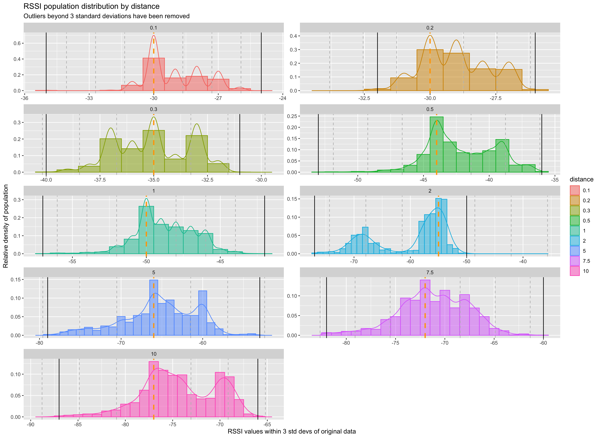
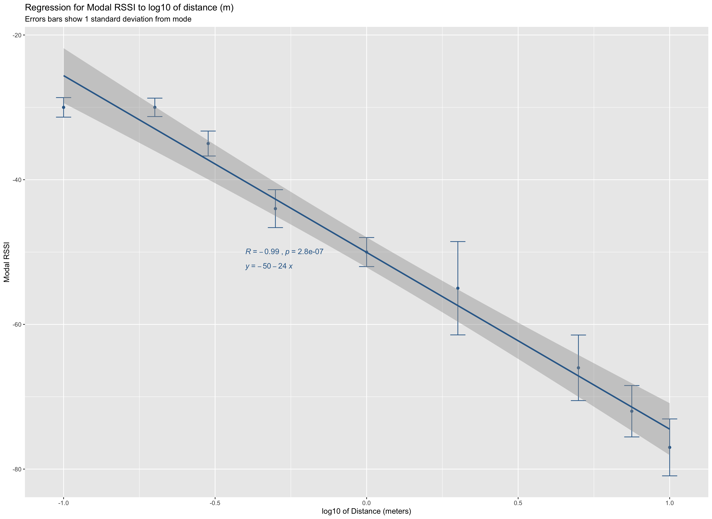

---
# Feel free to add content and custom Front Matter to this file.
# To modify the layout, see https://jekyllrb.com/docs/themes/#overriding-theme-defaults

layout: docs
title: Bluetooth Distance Estimation
description: Distance Estimation research
toc: true
toc_title: Distance Estimation
menubar: docs_menu
---

# Introduction

Measuring distance is a case of using a physical protocol based analogue, and later converting this based on physical attributes of the device and environment
to get to a distance estimation value.

## Calibration tool

Herald provides a sample [Bluetooth calibration tool](https://github.com/vmware/herald-calibration). Currently this supports iOS but Android is also in the works.

To use the tool on iOS simply:-
- Clone the repository above
- Open the ios folder project in XCode
- Modify the signing authority to be your own
- Deploy locally on two iPhones and run the app

Instructions of how to use the app are within it

To download the data after a test:-
- Plug the phone in to your mac
- Navigate to the PHONE NAME device in Finder
- Go to the Files tab
- Find the Bluetooth Calibration folder
- Copy all files to your local machine

After doing this you can generate analysis output:-
- Open the r/calibration-analysis.R script in RStudio
- Follow the instructions in that file to point to your data and generate analysis output

Please do contact us with any interesting Distance Estimation discoveries so we can
add them to this repository.

## Practical observations

During the development of the protocol we noticed some trends and approaches that worked well in testing to make the RSSI value calculated more accurate. We ended up rejecting these in favour of a raw RSSI value recorded at a fixed point in time purely because a separate scientific research effort being led by The Alan Turing Institute and the University of Oxford was assessing how RSSI could be processed. These efforts did not result in the development team being asked to take multiple measurements or perform any other 'at time of recording' data processing operations.

Nevertheless we did discover two interesting aspects of RSSI recording and distribution we shall now detail for background information important to the design of a measure to assess accuracy.

### Inability to use one distance conversion formula

We have found in testing that some RSSI calculations by Bluetooth chipsets use different scaling for RSSI.

Some chipsets use a log(distance) approach as is shown in the below diagram for communication
between an iPhone 7 and iPhone 7+. (in both directions)

Others use an inverse distance-squared scale instead. In our testing this is true between an iPhone 6 and an iPhone X (in both directions)

If using the wrong scaling curve the distance estimation will be least accurate between 1.5 and 3.5 metres in our testing, causing quite a difference
to a risk estimation.

This has two implications:-
- The appropriate distance conversion approach cannot be determine from calibration of a phone at a single distance - it must use several distances to determine the correct regression approach
  - This in turn dramatically increases the time taken to complete manual calibration in a radiation proof chamber. Alternative automated approaches should be considered.
  - This also likely means many current Bluetooth calibration readings used for distance estimation are invalid
- A log(distance) algorithm such as Prof Dr Ing's [[2]]({{"/efficacy/bibliography#a-2" | relative_url }}) approach to collecting calibration data cannot be solely relied upon, an equivalent process is needed for inverse square-distance too
  - This in turn increases the difficulty of passing on ever changing calibration data and new formulae to mobile apps for local distance estimation rather than centralised risk estimation (currently used decentralised approaches) and local summation as per the [Herald secured payload]({{"/payload/secured" | relative_url }})

### Running mean of RSSI values in Bluetooth

During early development the iBeacon API was assessed. This was eventually rejected as it did not allow a mechanism for easily exchanging cryptographic material necessary to ensure privacy and security of a proximity detection protocol, or provide a continuous variable for distance estimation. Whilst attempting to replicate the style of functionality of the iBeacon API in Core Bluetooth on iOS we discovered that a more accurate RSSI value (and thus distance estimation) could be achieved by taking a simple running mean of the last 5 RSSI readings taken. 

Whilst we did not have time to formally assess this improvement it appeared for short ranges to improve accuracy from 30cm to 10cm within a meter. It was also observed in an evaluation application showing both the iBeacon API and our RSSI mean model to respond quicker to changes in distance between devices, and settle down to an accurate value quicker than the iBeacon API itself. We presumed at the time that the iBeacon API must be doing something similar, but with perhaps more readings over a longer period of time.

Whilst crude, this is one way that abhorrent errors in individual RSSI readings could be alleviated in an algorithm to convert distance estimation analogues to distances. This calculation is out of scope of the paper.

### Modal value of a set of regular RSSI readings in Bluetooth

The author has produced a calibration application and calculated a basic algorithm for distance estimation as a reference model. The results discovered in this brief independent calibration work are of interest in to how bluetooth generally performs for distance estimation and so we publish the summary of them here in order to help inform debate. Other work has since been done by the Fraunhofer institute and the GSMA mobile phone manufacturers consortium to create a more accurate estimation algorithm and to provide calibration data.

I ran two calibration applications running on iOS to rapidly perform RSSI readings between the phones at a known measured distance. The application's user interface allowed the tester to specify the distance, providing the ability to take tens of thousands of readings per distance in a single test cycle before uploading the data for analysis.

Below shows the output of that analysis. The R scripts used to produce this and the application itself is available on request under the Apache-2.0 license.

This application can be used to determine the 'correct' RSSI reading for two known phones at a particular distance, and thus useful for formal evaluation of a proximity detection protocol's accuracy, and so we discuss the results here.

The above images show over ten thousands readings per contact event over approximately 4-5 minutes at each distance. The iPhones were kept in the foreground allowing a very high rate of RSSI readings to be taken. This would not be the case in a real application but it was useful to be able to discover RSSI distribution over time at each distance.

The orange dashed line shows the modal RSSI value rather than the mean. The grey lines are standard deviations (based on means of course), but shown either side of the mode rather than mean.

The thick black lines show the cut off of 2 standard deviations from the mode. Some outlier RSSI values are recorded here, but our analysis excluded these from the final mode calculation in order to prevent skew in the data set. (rare occasional abhorrent values over 20 from the actual RSSI value do occur with Bluetooth).

The distributions are not quite normal. It is likely this is due to how radio waves propagate and where the receiver is exactly positioned based on the multiple of wavelengths distance the receiver is from the transmitter.

What is clear though is that the modal value provides a strong signal when compared to mean or median, and is unaffected, given enough readings, by any skew due to not being an exact multiple of wavelengths away from the transmitter.

We further analysed these modal values to determine if they could be used to discover an algorithm for distance estimation that would act as a stop gap prior to further research being done on distance estimation algorithms. Whilst not related to the measures in this paper it is useful to complete the description of our experiences with Bluetooth calibration data. This formula was used in one place in this paper - to convert the 'distance' in the mock data to a target RSSI value, and thus to help estimate any error due to distance analogue bounding in a given protocol and its effect on overall efficacy score.

The result of using these modal values was a logarithmic function that provided the following distribution. Note that the values for RSSI have been processed as a log before plotting. The function is not linear.

This provided the following naive formula which we will call Fowler's formula for want of a better name, named after the author, naturally.

where D is the estimated distance in meters and RSSI-MODE is the modal RSSI value.

As per the chart the R value for the formula's fit was close to -1. This is no surprise as we are basing our regression on the mode rather than mean. The very small p value, however, indicates a good fit to the recorded test values.

It should be noted that this function is only valid for these two iPhones used in the test. There was no standardisation or calibration for particular phone models done. The Fraunhofer Institute used a similar approach. Refer to Prof Dr Ing's paper [[2]]({{"/efficacy/bibliography#a-2" | relative_url }}) . It uses a similar log estimation function but based on the mean RSSI value observed whilst generating pairwise phone calibration values rather than the mode.

We recommend an analysis is done in future study to see how many RSSI values would need to be read in quick succession to provide a reliable modal RSSI value close to a point in time in order to see if its use provides a better estimation function. It is possible, however, that research on probabilistic estimation functions has surpassed the accuracy of both the Fraunhofer and Fowler algorithms.

### The effect of movement on any RSSI processing approach

Any detection mechanism that uses multiple RSSI values within a time bucket will potentially provide a good fit if the phones are stationary for every RSSI reading in the set. If instead, however, the phones are on the move on different trajectories then this range of values may increase the error in the distance estimation.

We recommend further research to determine the effect on accuracy of different estimation functions in both static and moving conditions.