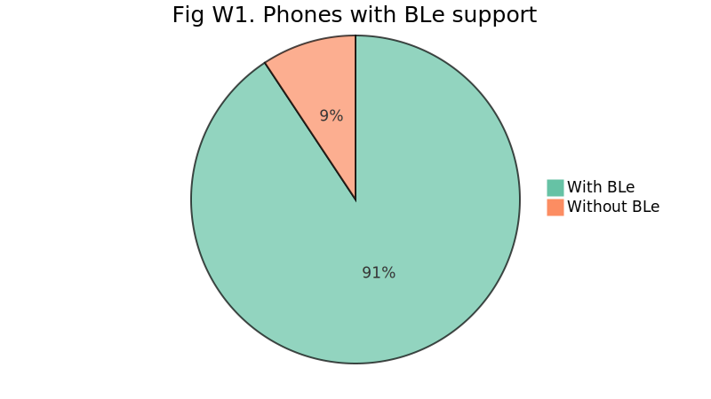
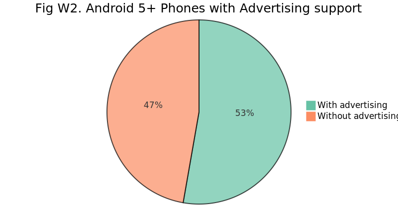
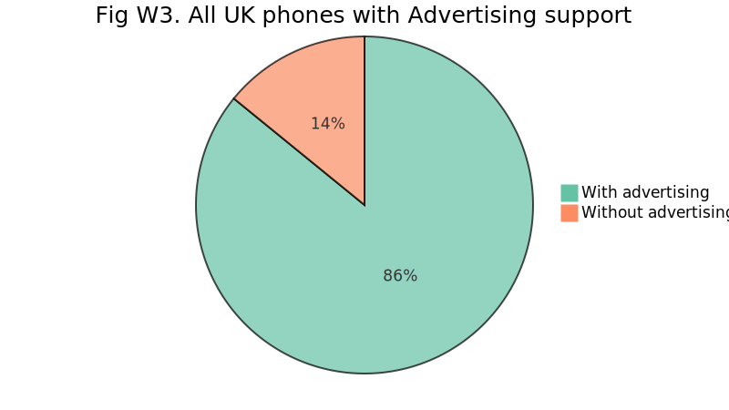
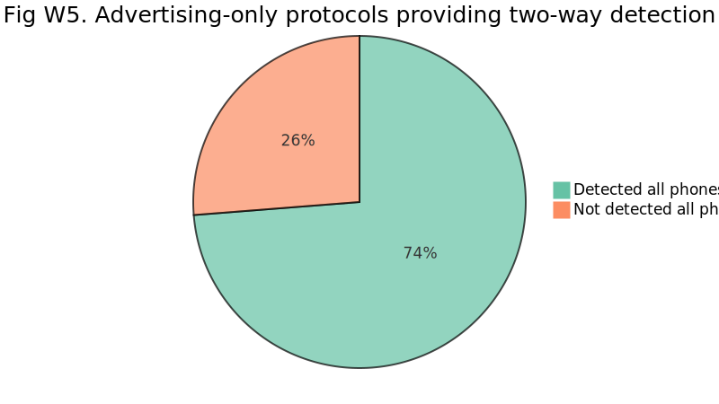
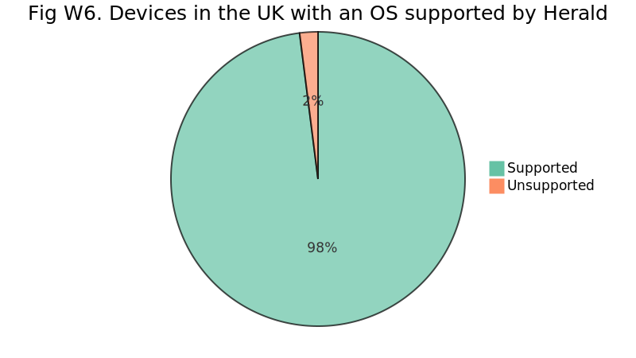

# Background Statistics

This page discusses the statistics quoted in the paper, efficacy measure, and on this website as they relate to efficacy.

There are specific quoted statistics for Herald too on the [Herald Performance]({{"/efficacy/herald" | relative_url }}) page. This page deals with general
issues relevant to Herald and other protocols.

It's important to remember that phone prevalance data is necessarily local - each country's mix is different. I chose
the UK as that's where I live. The websites mentioned below can be used to find your own local phone support mix.

There are two key physical limitations introduced by Bluetooth protocols that need to be understood:-

- Supported phones - Detecting the presence of a phone nearby to you - Affected by Bluetooth Advertising support and Operating System support
- Distance estimation - Accurately detecting the risk exposure - Affected by the frequency and accuracy of distance estimation (A combination of RSSI and TxPower and Phone model in Bluetooth)

## Supported phones

There are several aspects to phone support. One of these is 'supported hardware'. This encompasses two key aspects:-

1. Phones which support Bluetooth Low-Energy
2. Phones whose Bluetooth low energy support includes the ability to 'advertise'

For Herald we need only one phone in a pair to support advertising. Most other protocols use advertising only, and
therefore miss a significant minority of contact events.

All phone data quoted on this website are "Phones in use" and not based on "sold in market" or other estimates
that are not based on actual observed usage.

### Phone prevalance in the UK

The BBC data on active unique UK phone use collates unique
access devices that were geolocated via IP address to within the UK. This data lists specific device models
and their prevalence amongst UK BBC users. This data is not public, but has been provided by the BBC on 
request from the Herald team in Summer 2020. It is the most specific user data available for UK actual phones in use.

You can instead use data from statcounter, but it's less accurate at device make and model that the BBC app data.
BBC usage data is a combination of data from their website (where some client OS are obfuscated) and data from
BBC apps such as iPlayer that log the exact make, model and OS of the phone on which they are installed.

For the data where a specific version of an OS could not be determined in this data, we applied the prevalance of
known device type and OS type to this population to gain the most accurate estimate possible. No device prevalance
estimate is perfect - the numbers presented are the best estimate possible.

### Bluetooth Low-Energy support

Below are the number of unique phones in the UK from BBC data that support BLe. 

We then used the [GSM Arena website](https://www.gsmarena.com/) 
to determine individuals phones' Bluetooth support.

### Bluetooth Advertising support

In order for one Bluetooth device to 'see' or discover another Bluetooth device it must be able to
see its advertisement. All phones can scan for advertisements, but not all phones support acting as
an advertiser themselves.

For most other protocols, BOTH phones must support advertising. For Herald,
only one of a pair of phones must support advertising. This is because Herald uses short lived 
connections between devices in order to share information. This allows a Herald device that
cannot itself advertise to see another phone and 'tap it on the shoulder' and write its
data to the other phone. This allows Herald to support a wider segment of devices.

The raw data for this table is from [the AltBeacon website](https://altbeacon.github.io/android-beacon-library/beacon-transmitter-devices.html)

All iPhones with BLe support advertising, so this chart shows just the raw Android devices without advertising from the above website:-

When you calculate this up to population level and include iPhones too, you 
end up with the below chart:-

**NOTE**: This is the source of our '~14% of Android devices do not support advertising' statistic 
quoted on this website.

In order to determine which Contact Tracing protocols can detect individual random pairings of devices
and mutual two-way detection, you need to create a truth table for two phones with or without advertising:-

***Table W1. Phone pairing advertising truth table***

| Phone A Has advertising | Phone B has advertising | Percentage chance |
|---|---|---|
| Yes | Yes | 73.75% |
| Yes | No | 12.13% |
| No | Yes | 12.13% |
| No | No | 1.99% |

Herald works when your contact scenario is one of the first three options in the
above truth table, giving a likelihood of two-way detection of 98.01%.

Other protocols that support advertising-only can only support two-way
detection in the scenario on the first row of the table - or for 73.75% of pairings.

## Supported Operating Systems

Different contact tracing apps provide different OS support. Sometimes this
is because certain libraries, such as elliptic curve encryption libraries,
are provided only by certain OS versions, and the app uses this library
for communication.

Much of the time though the underlying Bluetooth protocol itself is limited
in the operating systems it supports.

Herald works on Android 5+ and iOS 9.3+. This gives it the widest support
of any Bluetooth protocol.

The source data for this section is in two parts [Android UK OS data](https://gs.statcounter.com/os-version-market-share/android/mobile-tablet/united-kingdom)
and [iOS UK OS data](https://gs.statcounter.com/os-version-market-share/ios/mobile-tablet/united-kingdom). Data as of July 2020.

I've totalled these up to make them easier to consume:-

***Table W2. iOS versions in the UK***

| iOS version | Percentage of UK devices | Note |
|---|---|---|
| 4.3-9.2 | 0.60% |
| 9.3-10.2 | 3.00% | Supports Bluetooth Low Energy |
| 10.3-13.4 | 28.36% | Supports elliptic curve encryption |
| 13.5+ | 68.02% | Supports the Exposure Notification API |

Below is the equivalent table for Android:-

***Table W3. Android versions in the UK***

| Android version | Percentage of UK devices | Note |
|---|---|---|
| 2.3-4.4 | 2.74% | |
| 5.0-5.1 | 5.61% | Supports Bluetooth Low Energy |
| 6.0-10 | 91.65% | Supports Exposure Notification API |

Again Herald supports a wider range of devices, going back to Android 5.0.

When you apply the UK device prevalence statistics from earlier sources
on this page to the above data, then you get the below OS support chart:-

## Distance estimation

The second important factor in contact tracing apps is accurate risk exposure detection.
This is comprised of the following items:-

- Frequency of distance estimations - [Fair Efficacy Paper]({{"/efficacy/paper" | relative_url }}) recommends at least once per 30 seconds. [Herald beats this]({{"/efficacy/herald" | relative_url }}).
- Scaling / bounding of distance estimations - Raw RSSI or 'bounds'. Bounding has a detrimental affect on efficacy. See the [Fair Efficacy Paper]({{"/efficacy/paper" | relative_url }}). Herald provides raw RSSI
- Calibrating readings for particular devices - Each device transmits at a different power. RSSI is good, but ideally you need the TxPower (if it varies) and phone make/model to get the most accurate reading.

For Calibration, there are a number of international formulae and approaches. This work is out of scope of Herald. Herald provides the raw data to an app. The app can choose the most appropriate mechanism to use.