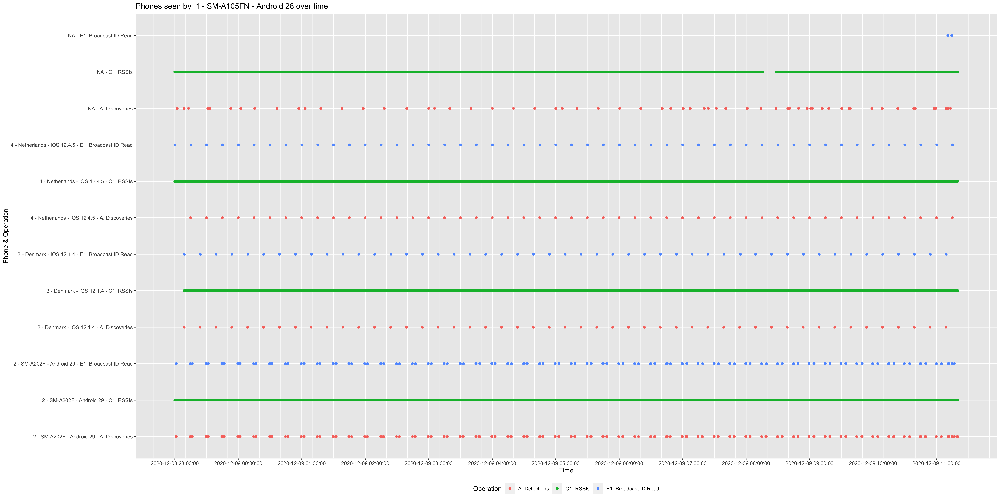
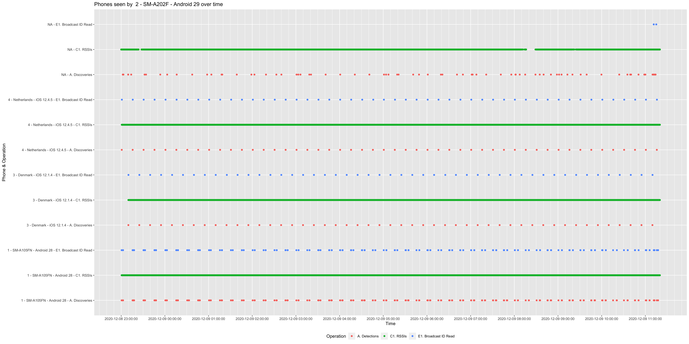
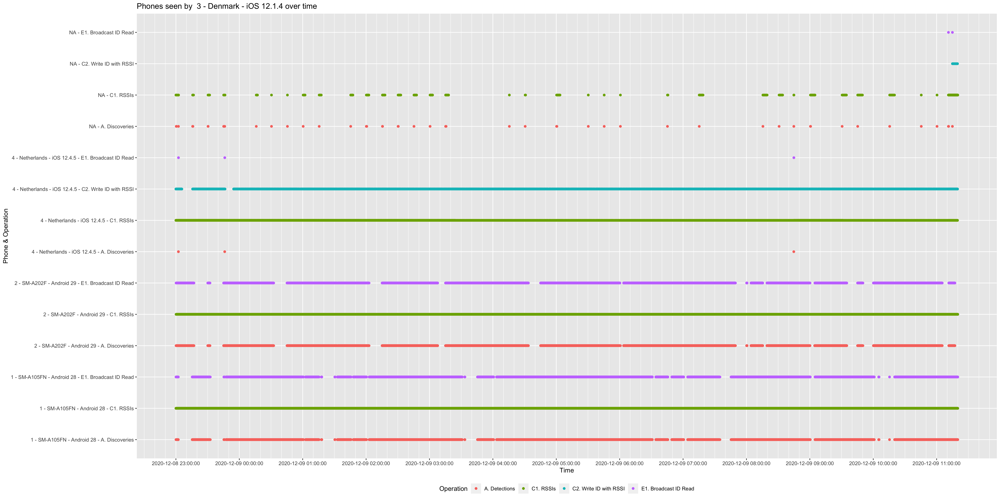
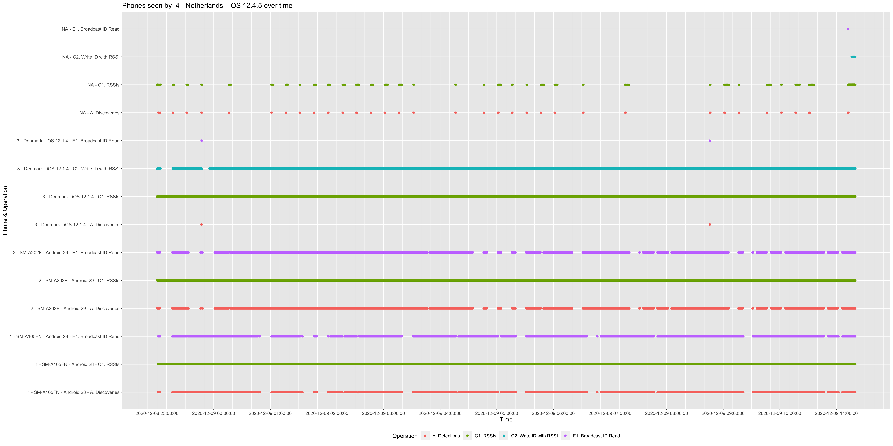
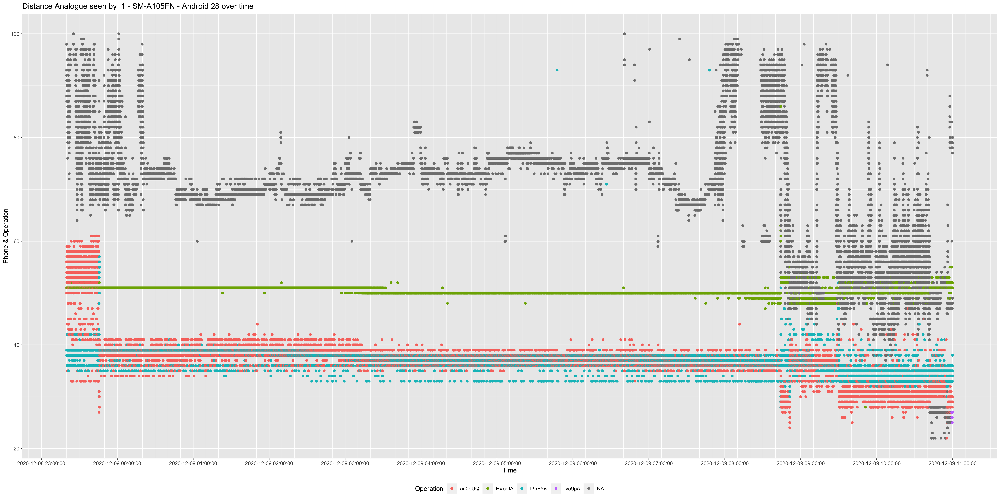
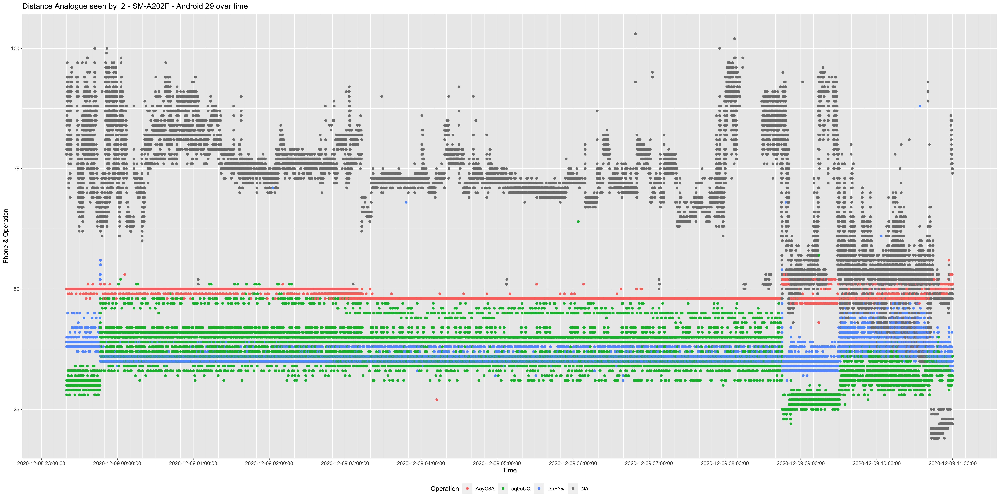
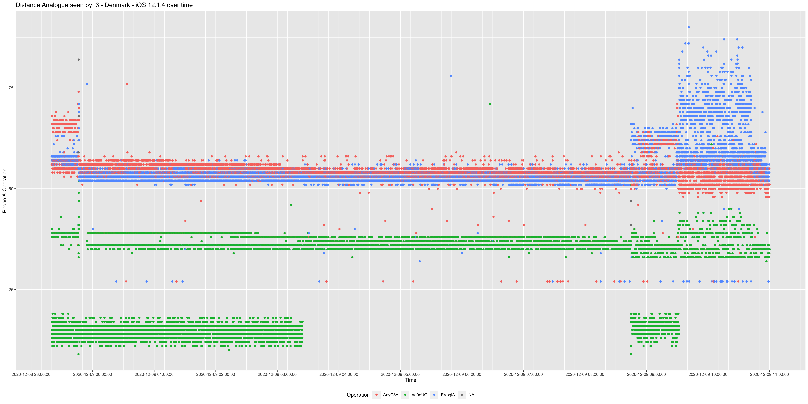
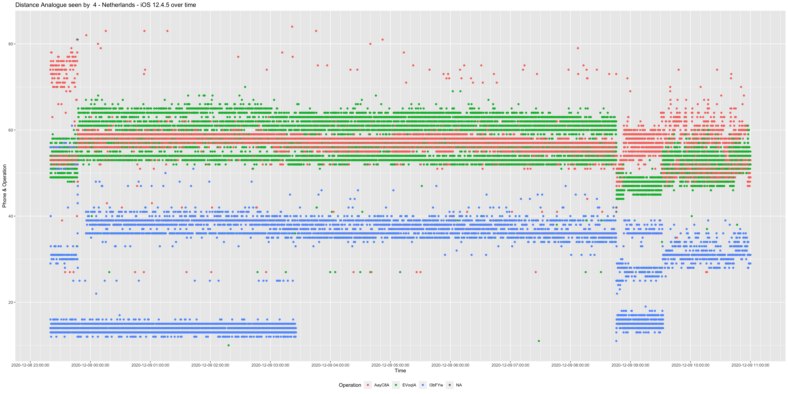
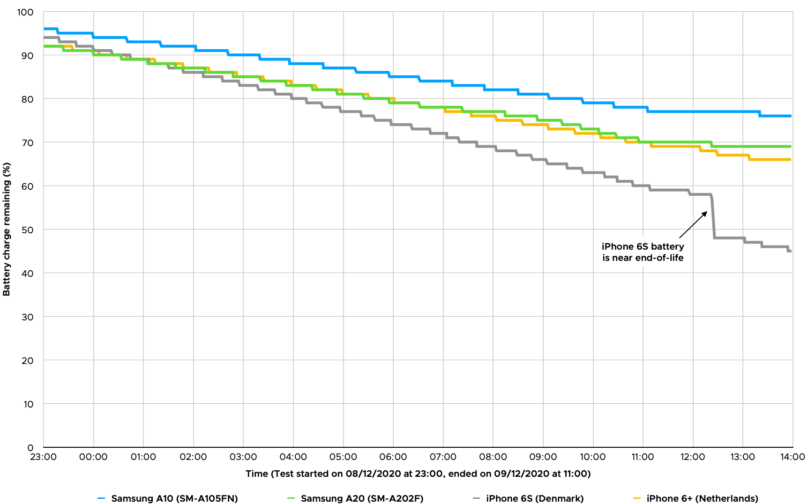

# 2020-12-08

A formal test on 4 phones (2 iOS, 2 Android) carried out on 8 Dec 2020 by Adam Fowler of the Herald Protocol development team as a pre-release test for Herald v1.2.0-beta2. These are the same 4 phones used for all Herald minor version and beta version performance regression tests.

Herald v1.2.0-beta2 made improvements in connection efficiency for both iOS and Android. Changes were also introduced to reduce overhead of the demonstration app user interface during background tests.

This resulted in only a single 30 second window being missed between the 4 phones in the test during a full 12 hour period. Mean time between RSSI readings has also been reduced from <= 4.39s to <= 1.44s. Battery usage was 1.9%, 2.2%, and 2.5% per hour for the Samsung A10, A20, and iPhone 6+. The log revealed the iPhone 6S battery is faulty and near end-of-life as it drains in steps (see battery chart below), therefore it is excluded from battery usage analysis.

The test was deliberately ran on known problem phones. A Samsung A10 on Android 29, Samsung A20 on Android 28, iPhone 6+ on iOS 12.4.5, and iPhone 6S on iOS 12.1.4. The Samsung A10 and A20 both rotate their BLE MAC address every few seconds, and the iPhones 6+ and 6S are test devices with worn batteries that have been in use since 2014 and 2015. The raw log data is available [here](herald-2020-12-08/20201208.zip) for analysis and inspection.

Completeness has not been recalculated, but is likely to be higher. We have used the current known value for this until a full 10 device test can be ran.

## Results

|Measure|Result|Notes|
|---|---|---|
|Overall Efficacy|<b>41.35%</b>|<b>Effective</b> (UK MAX 46.57%)|
|<i>Probability of detection</i>|94.37%|Formal RISK detection|
|Phone Detection|100%|Includes iOS in the background|
|Continuity|99.994%|Full continuity|
|Completeness RT1|98.36%||
|Completeness RT2|TBD|Not yet calculated from data|
|Completeness CE|95.95%||
|Accuracy|95.95%|RSSI accuracy|
|Longevity|99.93%|12 hour test|
|Mean time between readings|&lt;=1.44s||
|Country|UK||
|Have BLE Phones|72.53%|OFCOM reports|
|Hardware Support|98.19%|BBC data|
|Software/OS Support|98.00%|BBC data|
|Overall Pspec|69.79%||
|<i>Pspec squared</i>|48.71%||

## Phones tested

|PhoneId|Phone Make and Model|OS and version|Known issues|
|---|---|---|---|
|1|Samsung A10 (SM-A105FN)|Android 28|A10s knowingly rotate their BLE MAC address with every request. Herald uses an ephemeral ID that rotates every 15 minutes as a performance improvement.|
|2|Samsung A20 (SM-A202F)|Android 29|Same issue as A10, above.|
|3|iPhone 6S|iOS 12.1.4|Phone name is Denmark. Battery is faulty and near end-of-life as it loses charge in steps.|
|4|iPhone 6+|iOS 12.4.5|Phone name is Netherlands.|

## Fair Efficacy Stats Summary

|Phones|Max Pairs|Pairs Detected|Detection Percent|Max 30 second windows|30 second windows achieved|Missed windows percentage|Longevity change over 12 hours|
|4|12|12|100%|16800|16799|0.00595%|0.069%|

## Phone detection and distance estimation reports

The below 4 charts show discoveries, ID (data payload) reads, and RSSI (distance estimation) readings as individual dots.

The below chart shows RSSI variation over time. In a formal 12 hour test these will mostly be static.

The below chart shows battery charge remaining over time. Note the iPhone 6S has a faulty near end-of-life battery that loses charge in steps.

